# Introduction

In this lecture, we will explore the evolution of front-end development, focusing on the reasons behind the emergence of front-end frameworks like React. We'll begin by understanding how websites were built traditionally, the transition to single-page applications, and why using Vanilla JavaScript for complex applications can be problematic.

## Evolution of Web Development

### Server-Side Rendering (SSR)

- **Pre-2010 Web Development**: All websites were rendered on the server.
  - **Process**:
    - The server assembles the website based on data and templates.
    - The resulting HTML, CSS, and JavaScript are sent to the client (web browser).
    - The browser displays the content on the screen.
  - **Example**: Websites built with WordPress.

### Client-Side Rendering (CSR)

- **JavaScript Evolution**: Initially used for simple dynamics like animations and hover effects, often facilitated by libraries such as jQuery.
- **Rise of Single Page Applications (SPAs)**:
  - **Concept**: Web pages rendered on the client side, shifting the workload from the server to the browser.
  - **Characteristics**:
    - No page reloads needed for interactions.
    - Feels like a native desktop or mobile application.
    - Data is fetched from APIs to update the view dynamically.

### Resurgence of SSR

- **Modern Frameworks**: Tools like Next.js and Remix are bringing SSR back into popularity, combining benefits of both SSR and CSR.

## The Challenge with Vanilla JavaScript

### Complexity in Data Synchronization

- **Key Function**: Web applications handle data and display it in a user interface.
- **Core Challenge**: Keeping the UI in sync with data changes is complex.
- **Example Scenario**:
  - Consider an application like Airbnb with various interconnected data elements (list of apartments, search bar, filters, etc.).
  - Changing one piece of data (e.g., location or dates) necessitates updating several UI components (e.g., list of apartments, map).

### Issues with Vanilla JavaScript

1. **DOM Manipulation**:

   - Requires extensive direct manipulation (e.g., element selection, class toggling).
   - Leads to complex, hard-to-maintain code ("spaghetti code").

   ```javascript
   // Example of direct DOM manipulation
   const element = document.querySelector(".class");
   element.classList.toggle("active");
   element.style.color = "red";
   ```

2. **State Management**:
   - State is often stored directly in the DOM.
   - Leads to multiple parts of the app modifying the state, resulting in bugs and more complexity.

## Advantages of Front-End Frameworks

### Simplifying Data-UI Synchronization

- **Core Benefit**: Frameworks like React automate the synchronization of the UI with data changes, handling this complex task for developers.

### Structured Code

- **Consistent Practices**: Frameworks enforce a structured approach to building applications, reducing the likelihood of spaghetti code.
- **Team Consistency**: Teams can build applications in a consistent manner, leading to a more maintainable codebase.

## Conclusion

Modern web development heavily relies on JavaScript frameworks due to their ability to handle complex data synchronization and provide a structured, maintainable approach to building applications. Frameworks like React, Angular, and Vue simplify development by ensuring the UI stays in sync with data, promoting best practices, and enabling consistent team collaboration.

---

### Visual Aids

#### Diagram of Server-Side Rendering (SSR)

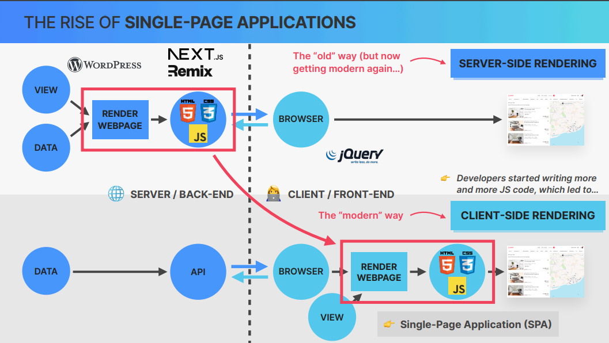

- **Label**: Server-side / Client-side rendering process.

#### Example of Direct DOM Manipulation Code

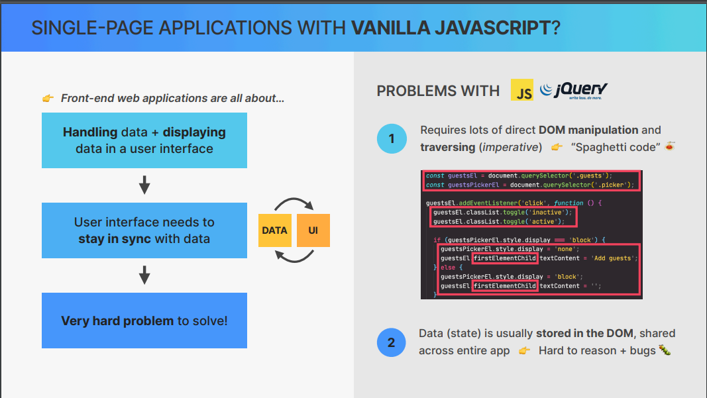

- **Label**: Example code illustrating DOM manipulation issues.

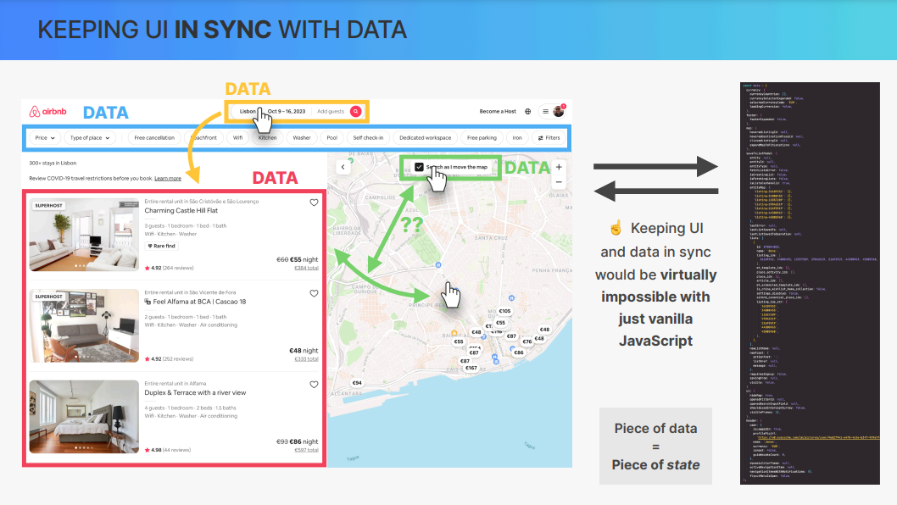

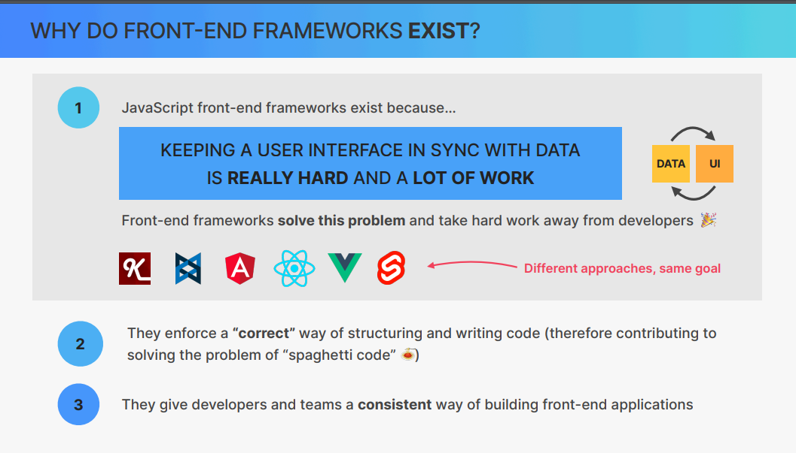

### Summary

Front-end frameworks exist to manage the complexity of keeping the user interface in sync with data changes. They offer solutions to the challenges of using Vanilla JavaScript, such as extensive DOM manipulation and scattered state management, and enforce best practices for building robust, maintainable applications.

2.

# Introduction to React vs. Vanilla JavaScript

In this lecture, we will compare the implementation of a simple advice application using React and Vanilla JavaScript. This comparison will help us understand how React simplifies keeping the user interface in sync with the state.

## Comparing React and Vanilla JavaScript

### Initial Setup

- **React Implementation**: All code, including JSX (JavaScript XML), is written in JavaScript.
- **Vanilla JavaScript Implementation**: HTML and JavaScript are written separately. The HTML file includes the JavaScript file.

### HTML and JavaScript Integration

- **React**: JavaScript handles everything, including HTML structure through JSX.
- **Vanilla JavaScript**: HTML is the primary structure, and JavaScript is included to manipulate the DOM.

### Selecting DOM Elements

- **React**: No need for manual DOM selection. Elements are managed through React’s state and props.
- **Vanilla JavaScript**: Manual selection of DOM elements using methods like `document.querySelector`.

### State Management

- **React**: State is managed within the component using `useState` or other state management hooks.
- **Vanilla JavaScript**: State values are declared as variables and manually updated.

```javascript
// Vanilla JavaScript State Management
let count = 0;
let advice = "";

// React State Management
const [count, setCount] = useState(0);
const [advice, setAdvice] = useState("");
```

### Event Handling

- **React**: Event handlers are attached using JSX attributes.
- **Vanilla JavaScript**: Event listeners are added manually to DOM elements.

```javascript
// Vanilla JavaScript Event Handling
button.addEventListener("click", getAdvice);

// React Event Handling
<button onClick={getAdvice}>Get Advice</button>;
```

### Updating the UI

- **React**: Automatically updates the UI when state changes.
- **Vanilla JavaScript**: Manually updates the UI by manipulating the DOM.

\`\`\`javascript
// Vanilla JavaScript DOM Update
document.querySelector('.count').textContent = count;
document.querySelector('.advice').textContent = advice;

// React State Update
setCount(newCount);
setAdvice(newAdvice);
\`\`\`

## The Core Difference

### React

- **Automatic Synchronization**: React ensures that the UI stays in sync with the state automatically.
- **Less Manual Work**: Developers focus on setting the new state, and React handles the UI updates.

### Vanilla JavaScript

- **Manual Synchronization**: Developers need to manually keep the UI in sync with the state.
- **More Manual Work**: Requires more code to manage state and update the DOM accordingly.

### Visual Aids

#### Side-by-Side Code Comparison


- **Label**: Comparison of React and Vanilla JavaScript implementations.

## Conclusion

React simplifies the process of keeping the UI in sync with the state by automatically updating the UI whenever the state changes. This reduces the amount of manual work and potential for errors compared to Vanilla JavaScript. As applications grow in complexity, the benefits of using React become even more apparent.

### Summary

Using React for front-end development significantly reduces the complexity of synchronizing the UI with state changes, making the development process more efficient and maintainable.
"""

3.

# Introduction to React: Overview and Key Concepts

In this lecture, we will get a high-level overview of what React actually is and how it works. This lecture is packed with information and promises to be super interesting. Let's dive in!

## What is React?

According to the official React documentation, React is a JavaScript library for building user interfaces. To provide a more helpful definition, we can say:

> React is an extremely popular, declarative, component-based, state-driven JavaScript library for building user interfaces, created by Facebook.

### Breaking Down the Definition

1. **Component-Based Design**: - React is all about components such as buttons, input fields, search bars, etc. - Components are the building blocks of user interfaces in React. - Complex UIs are built by combining multiple components, similar to LEGO pieces. - Example: In an application like Airbnb, the navbar, search bar, results panel, and map are all individual components combined to form a complex UI.
   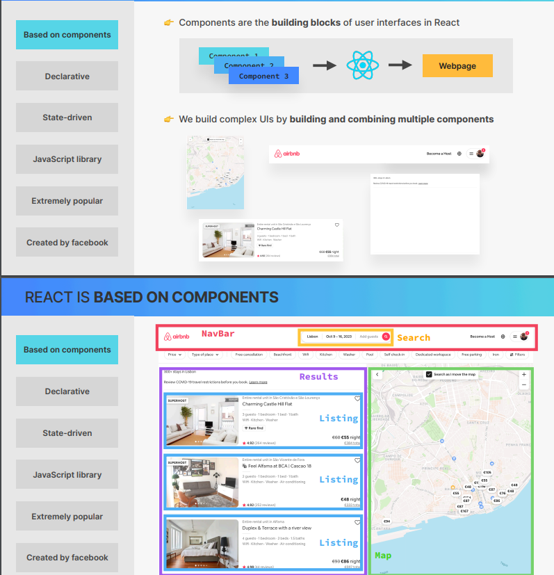
2. **Reusable Components**:

   - Components can be reused throughout the application.
   - Example: In a results panel with multiple similar listings, a single listing component can be reused with different data.

3. **Declarative Syntax (JSX)**:
   - JSX is a syntax that combines HTML, CSS, and JavaScript.
   - It allows us to describe what each component looks like and how it works.
   - React abstracts away the DOM, allowing developers to focus on the desired outcomes rather than the procedural steps to achieve them.
   - Example: We tell React what the UI should look like based on the current state, and React takes care of updating the DOM accordingly.
     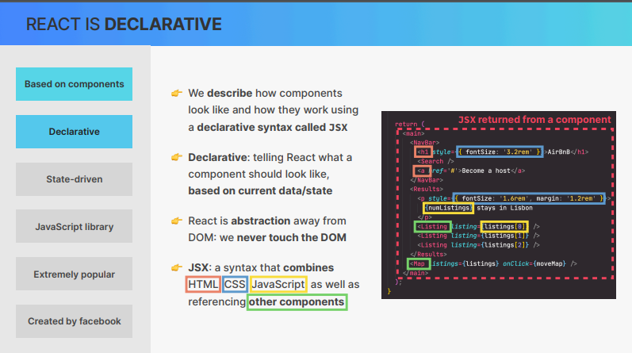

### How React Works with State

- **State Management**:

  - State refers to the data that drives the UI.
  - Example: An array of apartments in an Airbnb-like application.
  - React renders the UI based on the initial state and updates it whenever the state changes.
    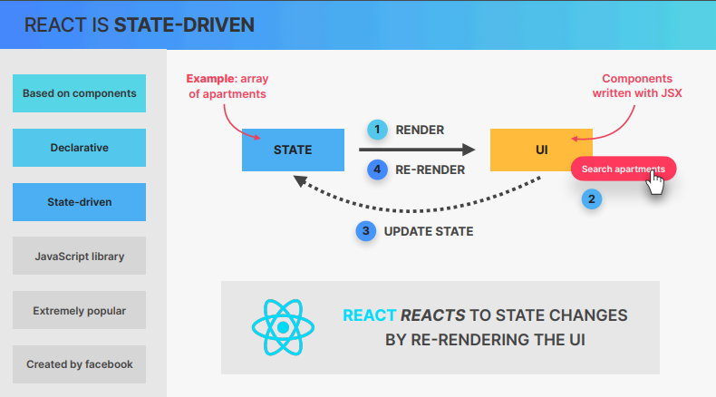

- **Reactivity**:
  - React automatically re-renders the UI in response to state changes.
  - This automatic updating mechanism is why React is named "React."

## Is React a Framework or a Library?

- **Library**:
  - React is primarily a library for the view layer of an application.
  - Building a complete application with React often requires additional libraries for routing, data fetching, etc.
  - Example frameworks built on top of React: Next.js and Remix.
    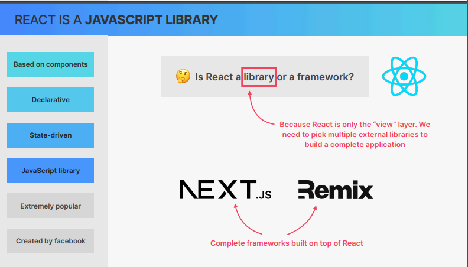

## Popularity and Community

- **Adoption**:

  - React is extremely popular and widely adopted by large and small companies alike.
  - This widespread adoption creates a high demand for React developers and a robust job market.
    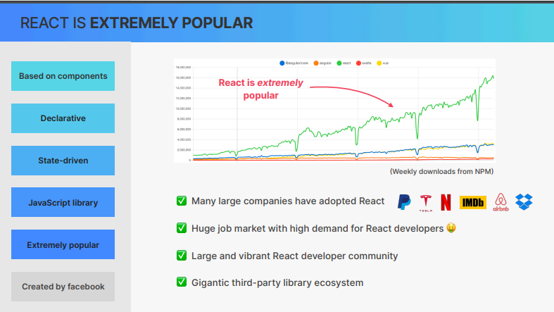

- **Community and Ecosystem**:
  - The large React community offers extensive support, tutorials, and third-party libraries.
  - This community-driven ecosystem enhances React's capabilities and ease of use.

## Origin of React

- **Created by Facebook**:
  - React was created in 2011 by Jordan Walke, an engineer at Facebook.
  - Initially used on Facebook's newsfeed and chat, it was later adopted across Facebook and Instagram.
  - React was open-sourced in 2013, revolutionizing front-end web development.
    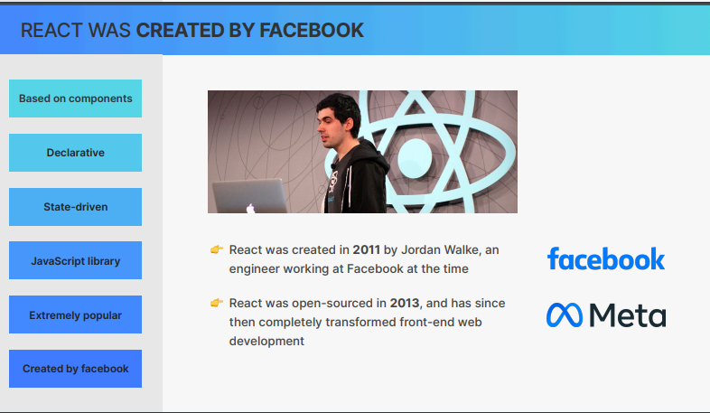

## Summary

React excels at two main tasks:

1. **Rendering Components**: Building user interfaces based on the current state.
2. **State Synchronization**: Keeping the UI in sync with the state by re-rendering components when the state changes.

React achieves this through various techniques, including the virtual DOM, Fiber tree, and one-way data flow.

### Next Steps

Now that you have a rough overview of what React is, let's set up our development environment and start writing some code!

#### JSX Syntax Example

\`\`\`jsx
function App() {
return (

<div>
<h1>Hello, React!</h1>
<button>Click Me</button>
</div>
);
}
\`\`\`

- **Label**: Simple example of JSX syntax combining HTML and JavaScript.

### Summary Points

- **React**: A declarative, component-based, state-driven library created by Facebook.
- **Components**: The building blocks of React applications, allowing for reusable and combinable pieces of UI.
- **JSX**: A declarative syntax to describe the UI.
- **State Management**: React updates the UI in response to state changes automatically.
- **Community**: A large and active community with a rich ecosystem of third-party libraries.
  """

````markdown
# Pure React Without Modern Tooling: A Simple Example

## Introduction

In this lecture, we explore how to write React code directly within a regular HTML file without any modern build tools or setup. This approach, while educational, demonstrates the necessity and convenience of using modern React development tools.

## Setting Up the Project

Start by creating a new project folder named "01-pure-React" on your desktop (or any preferred location).

## Creating the HTML Structure

1. Open your project folder in VS Code.
2. Create an `index.html` file with a basic HTML structure:

```html
<!DOCTYPE html>
<html lang="en">
  <head>
    <meta charset="UTF-8" />
    <meta name="viewport" content="width=device-width, initial-scale=1.0" />
    <title>Hello React!</title>
  </head>
  <body>
    <div id="root"></div>
  </body>
</html>
```
````

## Adding React Library

Include the React library directly in your HTML file:

```html
<script src="https://unpkg.com/react@latest/umd/react.development.js"></script>
<script src="https://unpkg.com/react-dom@latest/umd/react-dom.development.js"></script>
```

## Writing the First React Component

1. Create a new `<script>` section after including the React libraries.
2. Define a simple React component function named `App`:

```javascript
<script>
    function App() {
        return React.createElement('h1', null, 'Hello React!');
    }
</script>
```

## Rendering the Component

1. Create a root element using `ReactDOM.createRoot` to render your React component into the DOM:

```javascript
<script>
  const root = ReactDOM.createRoot(document.getElementById('root'));
  root.render(React.createElement(App));
</script>
```

## Observing the Output

Open `index.html` in your browser (preferably Google Chrome):

- You'll see a simple heading "Hello React!" rendered on the page.

## Adding Dynamic Content

1. Update the `App` component to display the current time:

```javascript
<script>
    function App() {
        const currentTime = new Date().toLocaleTimeString();
        return React.createElement('h1', null, `It's ${currentTime}`);
    }
</script>
```

2. Utilize `useState` and `useEffect` hooks to update the time every second:

```javascript
<script>
    function App() {
        const [time, setTime] = React.useState(new Date().toLocaleTimeString());

        React.useEffect(() => {
            const interval = setInterval(() => {
                setTime(new Date().toLocaleTimeString());
            }, 1000);
            return () => clearInterval(interval);
        }, []);

        return React.createElement('h1', null, `It's ${time}`);
    }
</script>
```

## Conclusion

While writing React without modern tooling provides insights into its fundamental workings, it lacks the efficiency and convenience offered by build tools like Babel and webpack. These tools automate JSX conversion, provide development servers, and enhance overall productivity in real-world projects.

```

```

# Working with Components, props and JSX.

So we'll learn how components are the building blocks of React applications, and how to create and reuse them using the powerful JSX syntax. We're also gonna share data between components using props and learn about rendering lists, conditional rendering and more.

````markdown
# Building the Pizza Menu Project from Scratch

## Introduction

Welcome to the Pizza Menu project that we're going to build from scratch in this section. In this lecture, we'll start fresh by deleting unnecessary files and setting up our project environment.

## Starting Fresh

1. Begin by deleting all unnecessary files in your project folder. Keep `index.html` as we'll use it as the entry point.
2. Open your browser and code editor side by side for easier viewing of the output.

## Setting Up `index.js`

1. Create a new file named `index.js` in your project folder. This file needs to be named exactly `index.js` because webpack expects the entry point to be named so.
2. Import `React` and `ReactDOM` into your `index.js` file:
   ```javascript
   import React from "react";
   import ReactDOM from "react-dom/client";
   ```
````

## Creating the App Component

1. Define your `App` component using a function:
   ```javascript
   function App() {
     return <h1>HI Hello !!!!!!!</h1>;
   }
   ```

## Rendering the App Component

1. Create a root element in your `index.js` to render your React component into the DOM:
   ```javascript
   const root = ReactDOM.createRoot(document.getElementById("root"));
   root.render(<App>);
   ```

## Observations on React Versions

1. Note that for React v18, rendering utilizes `createRoot` method of `ReactDOM`.
2. For older React versions (e.g., before v18), the rendering method was different:
   ```javascript
   React.render(React.createElement(App), document.getElementById("root"));
   ```

## Using Strict Mode

1. Enable Strict Mode by wrapping your `App` component:
   ```javascript
   root.render(
     <React.StrictMode>
       <App />
     </React.StrictMode>
   );
   ```
   Strict Mode helps identify potential issues in your application during development.

## Conclusion

Starting from scratch to build a React project involves setting up basic files, importing necessary libraries, defining components, and rendering them into the DOM. While older versions of React had different syntax for rendering, modern practices, like using `createRoot` and `StrictMode`, enhance development practices and catch potential issues early.

```

```

# Understanding React Components

## Introduction to Components

In React, components are fundamental building blocks that compose user interfaces. Every element in a React application, from the smallest button to complex UI sections, is encapsulated within a component.

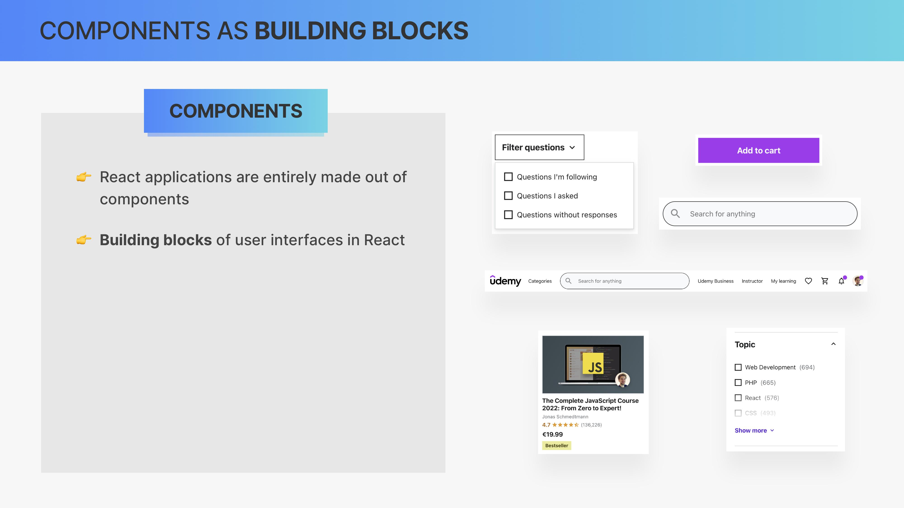

## Importance of Components

Components serve as the foundation of React applications. They encapsulate data, JavaScript logic, and appearance, defining how UI elements behave and look. React's main role is to render views for each component, collectively forming the user interface.


## Component as a UI Piece

A component can be conceptualized as a piece of the user interface. It defines both the functionality and the visual representation of a part of the application.

## Nesting Components

Components can be nested within one another, allowing for modular and reusable UI construction. This nesting capability enables developers to compose complex UIs by combining smaller, reusable components.


## Component Reusability

One of the key advantages of components is their reusability. Developers can create a component once and use it multiple times throughout their application, passing different data via props to customize each instance.

## Component Tree

A component tree visually represents the hierarchy and relationships between components within an application. It illustrates how components are nested and how they relate to one another, such as parent-child relationships.


### Example Component Tree

```

<App>
  <VideoPlayer />
  <Menu />
  <QuestionsList>
    <Question />
    <Question />
    <Question />
  </QuestionsList>
  <RefinedQuestions>
    <Filters />
  </RefinedQuestions>
</App>
```

The component tree helps developers visualize and understand the structure of their application's UI, facilitating component analysis and debugging.

## Conclusion

Understanding components is essential for developing React applications. They enable modular, reusable, and maintainable code by breaking down complex UIs into manageable parts. As we progress, we will delve deeper into advanced concepts like component reusability and efficient UI design practices.

```

```

````markdown
# Building React Components and Understanding Reusability

## Introduction

In this section, we will delve into creating and utilizing React components, a core concept in React development. We'll explore how components are structured, why they are pivotal in React applications, and how we can achieve reusability through component composition.

## Setting Up the Project

Before we begin, ensure you have the necessary starter files from the downloaded GitHub repository. Place these files appropriately within your project directory.

### Starter Files Overview

- **pizza-images/**: Folder containing images related to pizzas.
- **starter-data.js**: File with initial data for our application.
- **index.css**: CSS file for styling (to be moved to the `src` folder).

### Moving Forward with Components

Let's start by creating a new React component named `Pizza`. Components in React are typically written as functions, adhering to specific rules for proper functionality.

### Creating the `Pizza` Component

```jsx
import React from "react";

function Pizza() {
  return (
    <div>
      <h2>Pizza</h2>
    </div>
  );
}

export default Pizza;
```
````

Here, we've created a basic `Pizza` component that simply renders an `<h2>` element with the text "Pizza". Remember, every component function name must begin with an uppercase letter.

### Integrating the `Pizza` Component

To use our `Pizza` component, we need to include it within our main `App` component.

```jsx
import React from "react";
import Pizza from "./Pizza"; // Assuming it's located in the same folder as App

function App() {
  return (
    <div className='App'>
      <Pizza />
    </div>
  );
}

export default App;
```

### Enhancing the `Pizza` Component

Let's make the `Pizza` component more dynamic by incorporating data from our `starter-data.js` file and rendering it with JSX.

```jsx
import React from "react";
import pizzaImage from "../public/spinaci.jpg"; // Example image path
import data from "../public/starter-data"; // Example data import

function Pizza() {
  const pizzaData = data[0]; // Assuming first pizza from data

  return (
    <div>
      
      <h2>{pizzaData.name}</h2>
      <p>{pizzaData.ingredients}</p>
    </div>
  );
}

export default Pizza;
```

### Reusing the `Pizza` Component

Now, let's demonstrate component reusability by rendering the `Pizza` component multiple times within our `App` component.

```jsx
import React from "react";
import Pizza from "./Pizza"; // Assuming it's located in the same folder as App
import data from "../public/starter-data"; // Example data import

function App() {
  return (
    <div className='App'>
      <Pizza />
      <Pizza />
      <Pizza />
    </div>
  );
}

export default App;
```

By reusing the `Pizza` component, each instance can be customized with different data, demonstrating the power of component composition and reusability in React.

## Conclusion

Understanding components and their role in React applications is foundational to building scalable and maintainable user interfaces. As we progress, we'll explore advanced concepts like props for passing data into components, component lifecycles, and optimizing component performance.

```

```

Certainly! Here's the Markdown file for the entire response about JSX and its significance in React:

# Understanding JSX in React

## Introduction

In this section, we'll explore JSX (JavaScript XML), an essential part of React's syntax and why it plays a crucial role in building user interfaces.

## What is JSX?

JSX is a declarative syntax used in React to describe what components look like based on their data and logic. It resembles HTML but is actually an extension of JavaScript. JSX allows us to blend HTML, CSS, and JavaScript seamlessly within React components.
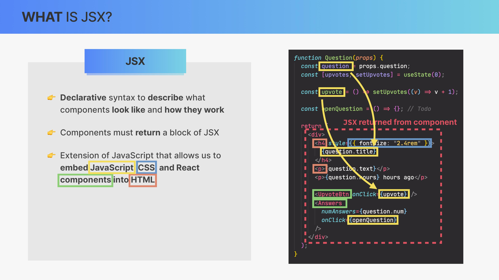

### Example of JSX

```jsx
function App() {
  return (
    <div>
      <h1>Hello, JSX!</h1>
      <p>This is a paragraph written in JSX.</p>
    </div>
  );
}
```

### JSX Conversion

Browsers cannot understand JSX directly, so it's converted into React function calls using tools like Babel behind the scenes. For instance, the above JSX code converts to:

```javascript
function App() {
  return React.createElement(
    "div",
    null,
    React.createElement("h1", null, "Hello, JSX!"),
    React.createElement("p", null, "This is a paragraph written in JSX.")
  );
}
```

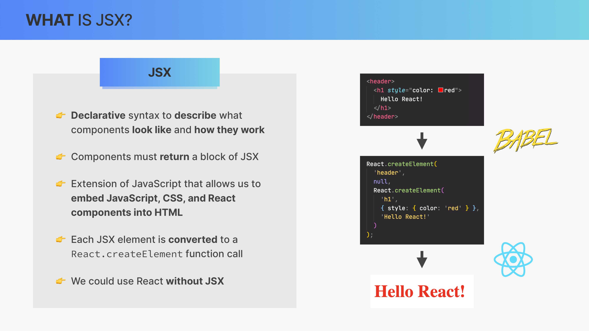

## Declarative vs Imperative Approach

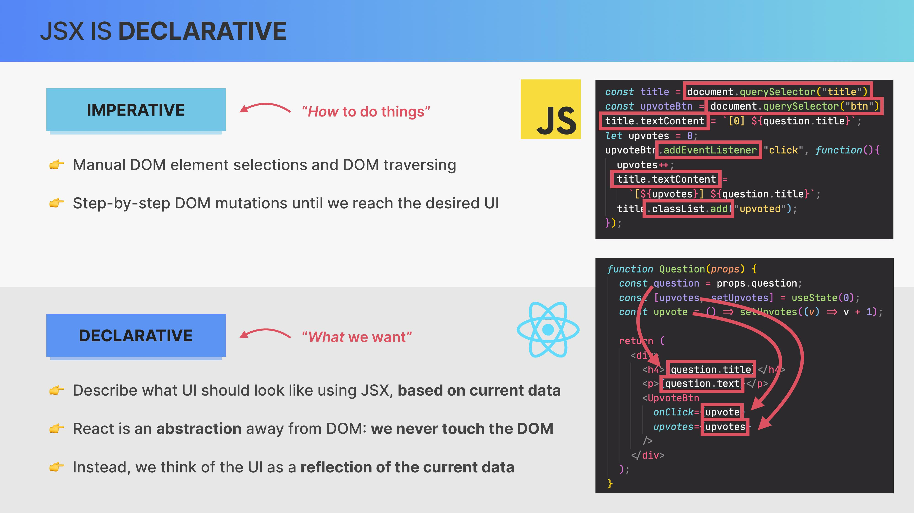

### Imperative Approach

In vanilla JavaScript, building UIs often involves imperative programming. Developers manually manipulate the DOM, selecting elements, and updating them step-by-step based on user interactions.

### Declarative Approach in React

React, in contrast, takes a declarative approach where developers specify what the UI should look like based on the current data (props and state). React then handles how to update the DOM efficiently.

### Advantages of JSX and Declarative Programming

- **Simplicity**: JSX simplifies the process of writing and maintaining UI code by integrating HTML-like syntax directly within JavaScript.
- **Readability**: JSX makes code more readable and intuitive, resembling the final UI structure.
- **Abstraction**: React abstracts away the DOM manipulation, allowing developers to focus on application logic rather than low-level operations.

## Conclusion

JSX is integral to React's philosophy of component-based UI development. By using JSX, developers can efficiently describe complex UI structures and leverage React's capabilities to handle rendering and updates under the hood.

Understanding JSX and its declarative nature is foundational for mastering React and building scalable, maintainable applications.

## Creating more components

It sounds like you're diving into building a React application with JSX! Based on what you've described, here's how you can create the components for your application: Header, Menu, and Footer.

First, let's create the Header component. This will display the name of your pizzeria.

```jsx
// Header.jsx
import React from "react";

function Header() {
  return <h1>Fast React Pizza Co.</h1>;
}

export default Header;
```

Next, let's create the Menu component. This will display the heading "Our Menu" and render the list of pizza components.

```jsx
// Menu.jsx
import React from "react";
import Pizza from "./Pizza";

function Menu() {
  return (
    <div>
      <h2>Our Menu</h2>
      <div className='menu'>
        <Pizza />
        <Pizza />
        <Pizza />
        <Pizza />
        <Pizza />
        <Pizza />
      </div>
    </div>
  );
}

export default Menu;
```

In the Menu component above, we assume there are six Pizza components included, as you mentioned.

Now, let's create the Footer component. Initially, you experimented with `React.createElement`, but let's simplify it using JSX. The Footer will display the message "We're currently open" along with the current time.

```jsx
// Footer.jsx
import React from "react";

function Footer() {
  const currentTime = new Date().toLocaleTimeString();

  return (
    <footer>
      <p>We're currently open</p>
      <p>Current time: {currentTime}</p>
    </footer>
  );
}

export default Footer;
```

To integrate these components into your main App component:

```jsx
// App.jsx
import React from "react";
import Header from "./Header";
import Menu from "./Menu";
import Footer from "./Footer";

function App() {
  return (
    <div className='App'>
      <Header />
      <Menu />
      <Footer />
    </div>
  );
}

export default App;
```

This approach leverages React's component-based architecture to manage complexity and maintainability, allowing you to compose smaller, reusable pieces into larger, more complex UIs.

## Incorporating JavaScript Logic in React Components

### Using JavaScript Inside Components:

React components are essentially JavaScript functions, so you can include any JavaScript logic inside them. This includes variable declarations, conditionals, and function calls.

```javascript
// Example: Incorporating JavaScript inside a React component
import React from "react";

function ExampleComponent() {
  // JavaScript logic inside the component
  const hour = new Date().getHours();
  console.log("Current hour:", hour);

  const openHour = 12;
  const closeHour = 22;

  let isOpen = false;
  if (hour >= openHour && hour <= closeHour) {
    isOpen = true;
    console.log("Restaurant is currently open!");
  } else {
    console.log("Sorry, the restaurant is closed.");
  }

  return (
    <div>
      <h1>Example Component</h1>
      <p>Current hour: {hour}</p>
      {isOpen ? <p>We're currently open!</p> : <p>Sorry, we are closed.</p>}
    </div>
  );
}

export default ExampleComponent;
```

# Seperation of concerns

### Evolution from Traditional Web Development

1. **Traditional Separation of Concerns**:

   - Previously, web development involved separate files for HTML, CSS, and JavaScript.
   - Each technology had its own file, focusing on one aspect of the application (structure, presentation, behavior).

2. **Shift towards Single Page Applications (SPA)**:
   - With SPAs, JavaScript became increasingly responsible for rendering UI and managing application state.
   - This integration meant that JavaScript dictated how HTML was constructed and modified.

### JSX and Component-Based Architecture

3. **Introduction of JSX**:

   - React introduced JSX, which allows blending HTML structure and JavaScript logic within components.
   - JSX facilitates writing UI components that are easier to understand and maintain because they co-locate data, logic, and presentation.

4. **Tightly Coupled Logic and UI**:

   - In modern web development, logic and UI are tightly coupled; changes in one often necessitate changes in the other.
   - React's approach of colocating logic and UI within components reflects this reality.

5. **React's Separation of Concerns**:

   - While React components mix HTML, CSS (through styles), and JavaScript, each component still embodies a single concern — managing one piece of the UI.
   - This is a shift from traditional file-based separation to a component-based separation.

6. **Component-Based Separation of Concerns**:

   - In React, each component encapsulates its data, logic, and appearance, maintaining a clear separation at the component level.
   - Components are reusable, composable, and encapsulate their own behavior, adhering to the principle of single responsibility.

7. **Acceptance and Adoption**:
   - Initially, JSX and React's approach faced skepticism due to breaking traditional norms of separation of concerns.
   - Over time, developers embraced React's model because it offers better maintainability, scalability, and encapsulation of UI elements.

### Conclusion

React's adoption of JSX and its component-based architecture represents a paradigm shift in web development. By integrating concerns within components rather than segregating them into different files, React achieves a more cohesive and efficient approach to building interactive user interfaces. This design choice supports scalability, code reuse, and easier maintenance, making it a popular choice for modern web applications.

### Styling in React Applications

In React, styling components can be approached in various ways, accommodating different preferences and project needs. Here, we'll cover the basics of inline styling and using external CSS files.

#### Inline Styling with JSX

Inline styling in React involves using JavaScript objects to define styles directly within JSX elements. Here's how it works:

```jsx
import React from "react";

const App = () => {
  const headerStyle = {
    color: "red",
    fontSize: "32px",
    textTransform: "uppercase",
  };

  return (
    <div>
      <h1 style={headerStyle}>Fast React Pizza Company</h1>
    </div>
  );
};

export default App;
```

#### Using External CSS Files

To apply styles from an external CSS file in React, follow these steps:

1. **Import the CSS file**: Import your CSS file at the top of your component or main file.

   ```jsx
   import "./index.css";
   ```

2. **Apply classes with `className`**: Use the `className` attribute (not `class`, due to JavaScript's reserved keyword) to apply styles from the imported CSS.

   ```jsx
   import React from "react";
   import "./index.css";

   const App = () => {
     return (
       <div className='container'>
         <header className='header'>
           <h1>Fast React Pizza Company</h1>
         </header>
         <main className='menu'>{/* Menu content here */}</main>
         <footer className='footer'>
           <p>We are currently open</p>
         </footer>
       </div>
     );
   };

   export default App;
   ```

3. **Global vs. Scoped Styles**: Styles imported via CSS are global by default in React. This means classes defined in your CSS file can be applied across different components unless overridden locally.

---

## Lecture Notes: Understanding Props in React

---

### Introduction

In this lecture, we delve into the fundamental concept of props in React. Props (short for properties) are essential for passing data between components, specifically from parent to child components. This mechanism allows for customization and reuse of components by providing them with dynamic data.

---

### Detailed Content

#### 1. Concept of Props

Props in React can be imagined as a communication channel between a parent component and a child component. They allow the parent to pass data down to its children, enabling each child component to be customized with unique data.

**Key Points:**

- Props are used for passing data from parent to child components.
- They enable customization and reuse of components with different data.

#### 2. Implementing Props in React

To implement props in React, we follow two main steps:

1. **Pass the Props:** Props are passed into a component by defining them as attributes.
2. **Receive the Props:** The child component then receives these props as a parameter.

**Example:**

_Parent Component (Menu):_

```jsx
<Menu>
  <Pizza
    name='Pizza Spinaci'
    ingredients='Spinach, Mozzarella, Tomato'
    photoName='spinaci.jpg'
    price={10}
  />
</Menu>
```

_Child Component (Pizza):_

```jsx
const Pizza = (props) => {
  console.log(props); // { name: "Pizza Spinaci", ingredients: "Spinach, Mozzarella, Tomato", photoName: "spinaci.jpg", price: 10 }
  return (
    <div>
      
      <h2>{props.name}</h2>
      <p>{props.ingredients}</p>
      <span>{props.price + 3}</span> {/* Example of adding a number to the price */}
    </div>
  );
};
```

#### 3. Customizing Components with Props

By using props, we can customize each instance of a component with different data. This flexibility allows us to reuse components efficiently.

**Example:**

_Parent Component (Menu) with Multiple Pizza Components:_

```jsx
<Menu>
  <Pizza
    name='Pizza Spinaci'
    ingredients='Spinach, Mozzarella, Tomato'
    photoName='spinaci.jpg'
    price={10}
  />
  <Pizza
    name='Pizza Funghi'
    ingredients='Tomato, Mushrooms'
    photoName='funghi.jpg'
    price={12}
  />
</Menu>
```

#### 4. Importance of Props

Props are a core feature of React, enabling dynamic and flexible components. They are not limited to strings or numbers but can also include arrays, objects, and even other React components.

**Key Takeaways:**

- Props allow passing diverse types of data.
- They enhance the flexibility and reusability of components.
- Props are fundamental to building dynamic and interactive React applications.

---

### Conclusion

In this lecture, we explored the concept of props in React, understanding how they facilitate data passing and component customization. By leveraging props, we can create flexible, reusable, and dynamic components that significantly enhance the functionality of our React applications.

---

## Lecture Notes: Advanced Understanding of Props in React

---

### Introduction

In this lecture, we review the essential concept of props in React and delve deeper into additional important aspects of props. Props are crucial for passing data between components, allowing for customization and communication within the component tree.

---

### Detailed Content

#### 1. Recap of Props

Props in React are used to pass data from parent components to child components. This mechanism allows parent components to control how their child components should look and function.

**Key Points:**

- Props are akin to arguments passed to JavaScript functions.
- Props can include any type of value: single values, arrays, objects, functions, or even other React components.

#### 2. Digging Deeper into Props

Now that we understand the basic use of props, it's essential to explore the types of data React uses to render components, namely props and state.

**Key Concepts:**

- **Props:** Data coming from the parent component, immutable and read-only.
- **State:** Internal component data that can be updated by the component's logic.

#### 3. Immutability of Props

Props in React are immutable, meaning they cannot be changed by the child component. This immutability ensures data consistency and prevents unintended side effects.

**Why Props are Immutable:**

- **Object Mutation:** Changing the props object in a child component would affect the parent component.
- **Pure Functions:** React components are designed to be pure, meaning they should not create side effects by mutating external data. This allows React to optimize the application and avoid bugs.

_Image: Props and State Flow_


#### 4. One-Way Data Flow

React employs a one-way data flow, where data can only be passed from parent to child components. This contrasts with frameworks like Angular, which use two-way data flow.

**Advantages of One-Way Data Flow:**

- **Predictability:** Easier to understand where data is coming from.
- **Debugging:** Simplifies debugging by providing more control over data flow.
- **Performance:** More efficient and performant than two-way data binding.

_Image: One-Way Data Flow in React_


#### 5. Comparison with Two-Way Data Binding

React's one-way data flow simplifies development and debugging compared to two-way data binding in other frameworks, making applications more predictable and easier to maintain.

**Example:**

```jsx
// Parent Component
<Menu>
  <Pizza
    name='Pizza Spinaci'
    ingredients='Spinach, Mozzarella, Tomato'
    photoName='spinaci.jpg'
    price={10}
  />
</Menu>
```

_Image: Data Flow in React_


#### 6. Prop Mutability and State

If you need to change data within a component, you should use state instead of props. State allows internal component data to be updated over time.

**Key Takeaways:**

- Use props for passing static data from parent to child.
- Use state for data that changes over time within the component.

---

### Conclusion

In this lecture, we reviewed the fundamentals of props in React and explored advanced aspects such as immutability, one-way data flow, and the distinction between props and state. Understanding these concepts is crucial for building efficient and predictable React applications.
